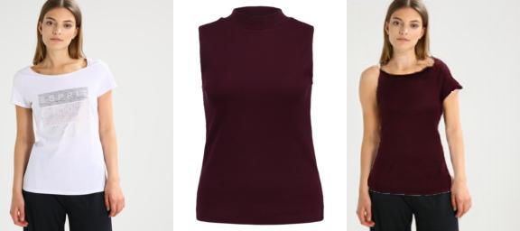
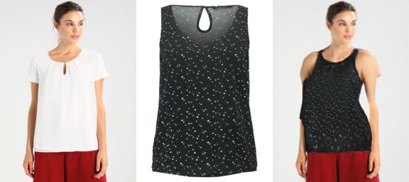
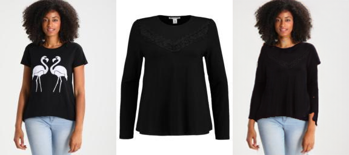
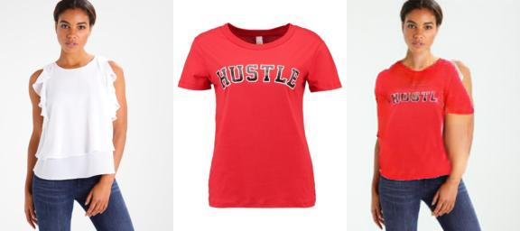

## ModelExplaination
ACGPN, which stands for Adaptive Content Generating and Preserving Network, is a deep learning model designed for virtual try-on applications. It's essentially a type of artificial intelligence (AI) that allows you to see how clothes would look on you in a photo  using image processing techniques.

Here's a breakdown of how it works:

Understanding the Image: ACGPN takes three inputs:

The image of the clothing you want to try on.
A "pose map" that outlines the position of your body parts in the photo you'll be virtually trying the clothes on.
A mask that segments different body parts in the photo (like arms, legs, torso).
Predicting the Look:  The model uses these inputs to predict how the clothes would look on you. It essentially creates a blueprint (semantic layout) of what the final image should look like.

Warping the Clothes:  ACGPN then takes the clothing image and warps it (adjusts its shape)  based on the predicted layout from step 2. To make this warping more realistic, the model uses a special technique to ensure a smooth transformation.

Putting it all Together:  Finally, ACGPN combines the warped clothes image with your original photo, filling in any missing parts or gaps using a process called inpainting. This creates the final image of you virtually wearing the clothes.

## Dataset
**VITON Dataset** This dataset is presented in [VITON](https://github.com/xthan/VITON), containing 19,000 image pairs, each of which includes a front-view woman image and a top clothing image. After removing the invalid image pairs, it yields 16,253 pairs, further splitting into a training set of 14,221 paris and a testing set of 2,032 pairs.

